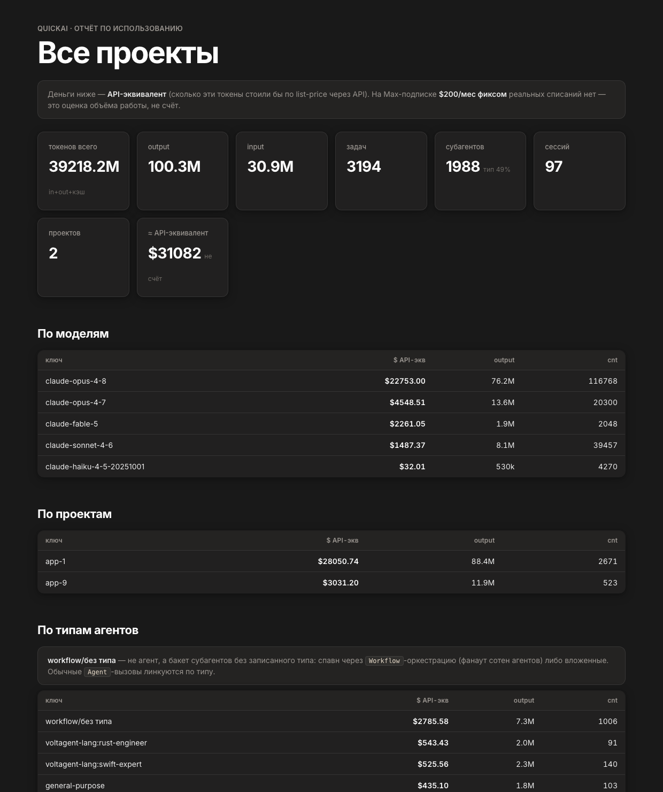
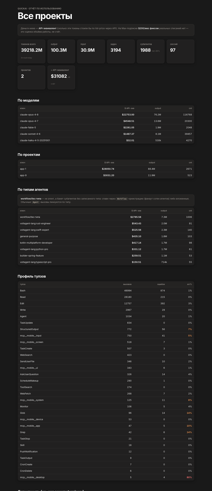
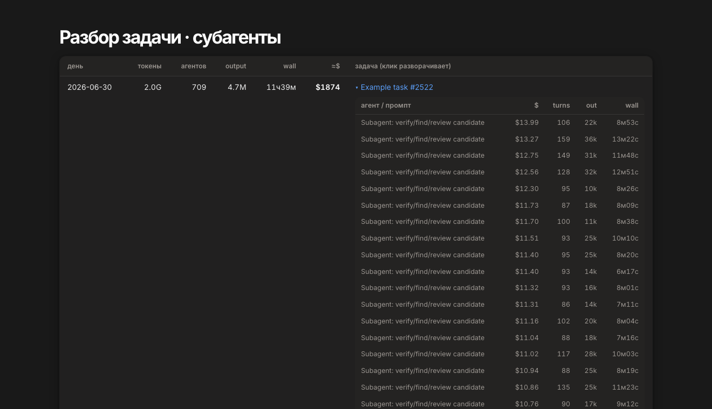

# quickai

**Profiler for Claude Code.** See exactly where your tokens, money and *time* go —
per task, per subagent, per model — straight from the transcripts Claude Code already
writes to disk. No instrumentation, no telemetry, nothing leaves your machine.



Most Claude Code users are on a **flat subscription**, so quickai leads with **tokens**
(and time), not dollars. The `$` figures are an **API-equivalent** (what those tokens
would cost pay-as-you-go) — a measure of *volume and ROI*, not a bill.

- **Where the money/tokens went** — top tasks, projects, models, agent types
- **Where the *time* went** — wall vs idle, per-task timeline, "why was the harness slow?"
- **Behavior profiling** — tool usage & error rates, cache-hit health, spinning tasks, waste
- **Per-project reports** and a self-contained **HTML report** you open in the browser
- **MCP server** — ask all of the above straight from a chat

---

## 1. Installation

Requires **Rust** (1.75+). SQLite is bundled — no system deps.

```sh
git clone https://github.com/AlexGladkov/quickai.git
cd quickai
cargo build --release
# binary: ./target/release/quickai   (optionally: cp it into ~/.local/bin)
```

First run builds the index from `~/.claude/projects/**/*.jsonl`:

```sh
./target/release/quickai index
```

The index lives at `~/.claude/quickai.db` (pure derivative of the transcripts —
delete and rebuild anytime). Re-run `index` whenever you want fresh data; it's
**incremental** (only reads the tails of changed files).

---

## 2. Example

```sh
# overall summary (tokens first, $ as API-equivalent)
quickai stats

# your actual prompts, biggest first
quickai tasks --by tokens --limit 20

# why was a run so long? wall vs idle time
quickai slow

# generate the full HTML report and open it in the browser
quickai report

# report for a single project
quickai report --project my-app
```

`quickai stats` output:

```
quickai — index summary
  projects:   18
  sessions:   97
  tasks:      3182
  subagents:  1988 (type resolved for 981 — 49%)
  turns:      185699
  ── tokens ──
  total:      40709.4M  (input+output+cache)
    fresh (in+out): 135.2M
    input:    31.4M
    output:   103.8M
    cache-read: 39461.8M (96% throughput — context re-reads)
  ≈ API-equivalent: $32042.66  (list-price; subscription is flat — this is volume, not a bill)
```

---

## 3. Screenshots

**Report — summary & breakdowns** (dark Notion-style theme, project name up top):


**Behavior profiling** — tool error rates, cache-hit health, spinning, waste, slow tasks
(problem numbers are colored at a glance):



**Per-task drill-down** — click any task to expand its subagents with cost / turns / wall time:



---

## 4. What you can generate

### CLI commands

| Command | What it shows |
|---|---|
| `quickai index [--rebuild]` | Build / refresh the index (incremental) |
| `quickai stats` | Overall summary — tokens, subagents, API-equivalent |
| `quickai tasks [--by time\|tokens\|cost] [--project X]` | Your prompts, broken down |
| `quickai usage` | One-screen report in the terminal (pager) |
| `quickai report [--project X]` | **HTML report** → browser (per-project optional) |
| `quickai top --group task\|agent\|agenttype\|project\|model` | Top consumers |
| `quickai task <promptId>` | One task: main agent + all subagents + timing |
| `quickai bench <agentType>` | One agent type over time |
| `quickai cache` | Cache-hit health per session (find cache thrashing) |
| `quickai latency` | Model turn-latency + subagent parallelism factor |
| `quickai spin` | Spinning tasks (many turns, low output/turn) |
| `quickai tools` | Tool usage & error rates |
| `quickai waste` | `stop_reason` distribution (truncations, refusals) |
| `quickai slow` | Long tasks by wall time + **idle %** (why the harness was slow) |
| `quickai mcp` | Run the MCP server (stdio) |

### The HTML report bundles

Summary cards · by model / project / agent-type · tool profile · latency · parallelism ·
cache-hit health · spinning · waste · **slow tasks with idle %** · and every task with a
searchable, sortable table and expandable subagent breakdown.

### MCP (ask from a chat)

```sh
claude mcp add quickai -- /absolute/path/to/target/release/quickai mcp
```

Then ask things like *"profile the **my-app** project"*, *"what ate the most this week"*,
*"break down task X"*, *"why was that run so slow"*. Most tools accept a `project`
filter, so "profile this project" just works. Tools: `quickai_stats`, `quickai_top`, `quickai_tasks`,
`quickai_usage`, `quickai_task`, `quickai_bench`, `quickai_cache`, `quickai_latency`,
`quickai_spin`, `quickai_tools`, `quickai_waste`, `quickai_slow`.

---

## Notes

- **Money** is an API-equivalent (list-price × tokens), not a bill — on a subscription
  there are no per-token charges. It's a volume/ROI signal.
- **No "% of subscription capacity"** — Anthropic doesn't publish a fixed token cap
  (limits are windowed and metered opaquely), so any such % would be made up.
- **Claude Code only** for now. The core (schema, queries, report) is source-agnostic —
  only the parse layer is Claude-specific, so other CLIs could be added via adapters.

Architecture & data model: [ARCHITECTURE.md](ARCHITECTURE.md).

## License

MIT — see [LICENSE](LICENSE).
